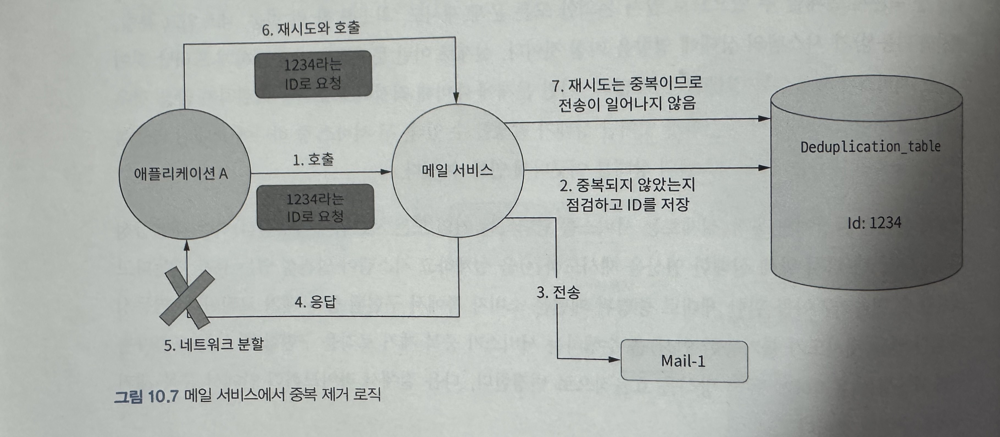

### 중복 제거 라이브러리의 단순한 구현
 
* 중복제거 로직 Flow
```java
public class NavieDeduplicationService {
    private final DbClient dbClient = new DbClient();

    public void executeIfNotDuplicate(String id, Runnable action) {
        boolean present = dbClient.find(id);
        if (!present) {
            action.run();
            dbClient.save(id);
        }
    }
}
```

