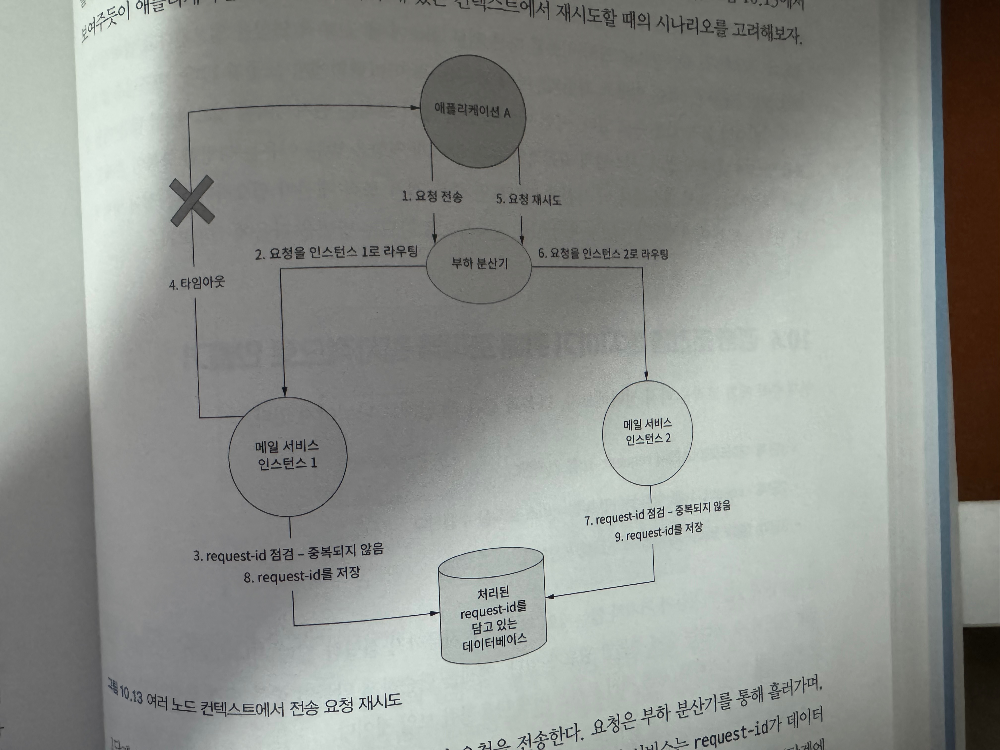

### 분산된 시스템에서 중복제거를 구현할 때 흔히 저지르는 실수
#### 노드가 하나만 있는 컨텍스트
* 중복제거를 위한 로직임에도, 실패 복구절차가 중복을 만들 수 있음.
* 네트워크등 다른 부분에서도 문제가 생길 수 있음.

#### 다중 노드 컨텍스트
* 비동기 / 지연 응답이 중복을 유발
  * 아래 그림의 사례로 설명
    

* 결론 : 중복제거 로직은 워자적이지 않고, 더욱 많은 중복을 만들어낼수도 있음.

