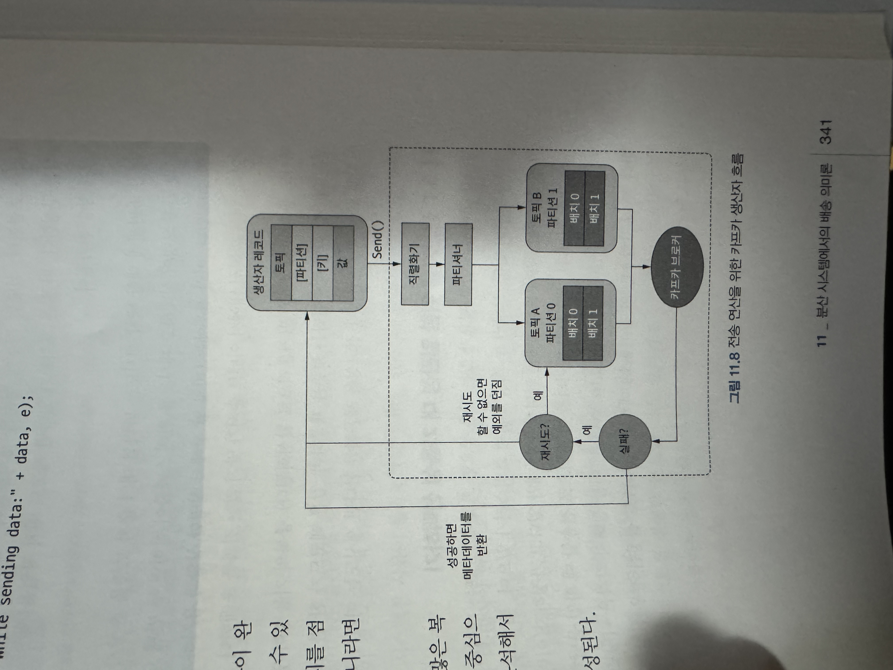

### 생산자 로직
* 카프카 생산자의 필수구성
  * 부트스트랩 서버
    * 생산자는 부트스트랩 서버를 사용해 이벤트가 전송돼야 할 장소를 결정함.
    * 모든 카프카 레코드는 Key-Value로 구성되어있음.
    * 카프카 생산자 구성 생성
        ```java
        @Configuration
        public class SenderConfig {

            @Value("${kafka.bootstrap-servers}")
            private String bootstrapServers;

            @Bean
            public Map<String, Object> producerConfigs() {
                Map<String, Object> props = new HashMap<>();
                props.put(ProducerConfig.BOOTSTRAP_SERVERS_CONFIG, bootstrapServers);
                props.put(ProducerConfig.KEY_SERIALIZER_CLASS_CONFIG, IntegerSerializer.class);
                props.put(ProducerConfig.VALUE_SERIALIZER_CLASS_CONFIG, StringSerializer.class);
                return props;
            }

            @Bean
            public ProducerFactory<Integer, String> producerFactory() {
                return new DefaultKafkaProducerFactory<>(producerConfigs());
            }


            @Bean
            public Producer<Integer, String> producer() {
                return producerFactory.createProducer();
            }


            @Bean
            public KafkaTemplate<Integer, String> kafkaTemplate() {
                return new KafkaTemplate<>(producerFactory());
            }

            @Bean
            public Sender sender() {
                return new Sender();
            }
        }
        ```




#### 생산자를 위한 일관성 대 가용성 선택하기
* 생산자 쪽에서 고민할 필요가 있는 중요한 트레이드 오프
  * 데이터의 일관성과 가용성 사이에서의 선택
    * acks = all 일때는 가용성 대신 일관성 선택
      * 토픽(데이터)이 모든 브로커에 복제되었다는 응답을 받을 때까지 생산자가 대기
      * 브로커중 하나가 장애가 생겨도 각 브로커의 데이터는 일치한다는 일관성 보장 -> 장애가 있으면 응답이 늦거나 실패처리되어 가용성이 보장되지 않음
    * acks = 1 일때는 일관성 대신 가용성 선택
      * 한 브로커에만 토픽(데이터가)저장되면 성공드로 처리되고, 비동기로 나머지 브로커에 복제함
      * 리더 브로커가 죽기전에 복제되지 않으면 데이터 일관성이 보장되지 않음. -> 나머지 브로커가 죽더라도 리더 브로커가 살아있으면 계속 동작하니 가용성은 보장됨.
