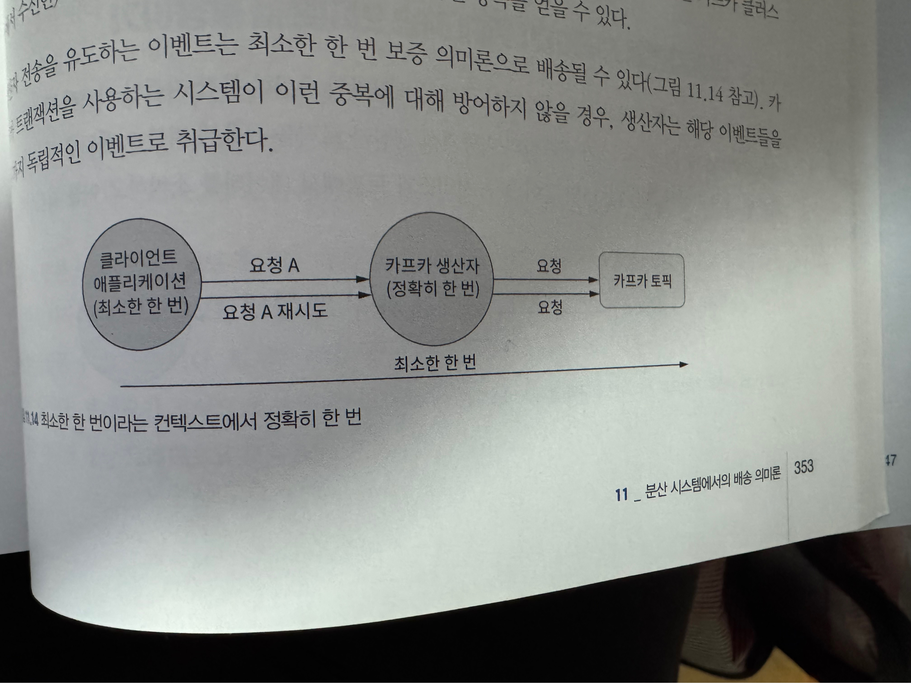

### 소비자 코드와 다양한 배송 의미론
#### 수동으로 소비자 커밋하기
* 오프셋 커밋 시점이 시스템에 진입할 때 인지 처리를 마친 후인지 결정 하는것이 중요.
  * 배송 의미론을 유지하고 싶다면 처리 로직 이후에 커밋하는게 좋음.
* 동기식 커밋
  ```java
  public void startConsuming() {
    try {
        while (true) {
            ConsumerRecords<Integer, String> records = 
                consumer.poll(Duration.ofMillis(100));
            
            for (ConsumerRecord<Integer, String> record : records) {
                logicProcessing(record);
                try {
                    consumer.commitSync();
                } catch (CommitFailedException e) {
                    LOGGER.error("commit failed", e);
                }
            }
        }
    } finally {
        consumer.close();
    }
  }
  ```

* 비동기식 커밋
  ```java
  consumer.commitAsync(
      (offsets, exception) -> {
          if (exception != null) LOGGER.error("Commit failed for offsets {}", offsets, exception);
      });
  ```

#### 가장 처음 오프셋 또는 가장 최신 오프셋에서 재시작하기
* 앱이 재시작 할때 처리를 계속하기 위한 방법
  * auto.offset.reset 전략
    * earliest로 설정 했을때, 이벤트 처리를 계속하는 작업이 존재한다면 마지막으로 커밋된 오프셋부터 시작한다. (오프셋이 존재하지 않으면, 처음부터 모든 이벤트의 재처리 작업을 시작한다.)
    * 중복된 이벤트를 얻을수도 있음.
      * 후속 레코드 처리중에도 소비자 로직의 장애가 언제든지 발생할 수 있기 때문.
    * 최소 한번의 배송 의미론을 제공함.
  * 가장 최신 오프셋 전략
    * 장애가 생긴 이후 주어진 토픽에 대한 오프셋이 없을때 처리를 계속하기 위해 토픽의 가장 최신 오프셋에서 시작함.
    * 장애가 생기기에 앞서 배송된 이벤트를 잃어버릴 수 있음.
      * 배송은 되었으나, 처리되지 않은 상황
    * 중복된 이벤트는 없지만 이벤트를 잃어버릴 수 있다.
    * 최소한 한번 배송은 보증함.

#### (사실상) 정확히 한번 의미론
* 로직에 멱등성이 없고, 어떤 이벤트도 잃어버릴 수 없다면 정확히 한번이라는 형태가 필요하다.
* **사실상**인 이유: 몇몇 계층에서 이벤트가 중복될 수 있기때문.
  * 생산자쪽의 재시도 로직이 중복을 만들 수 있음.
  * 카프카는 분산 트랜잭션의 형태를 구현하는 방식으로 사용하고있음.
  
  * 트랜잭션을 구현하지 않고 최소한 한 번 배송 의미론을 제공한다고 가정하면, 클라이언트는 장애가 발생하는 경우에 요청을 재시도 할 수 있음.
  * 시스템의 성능과 가용성에 대해 주의하며 사용해야함.
