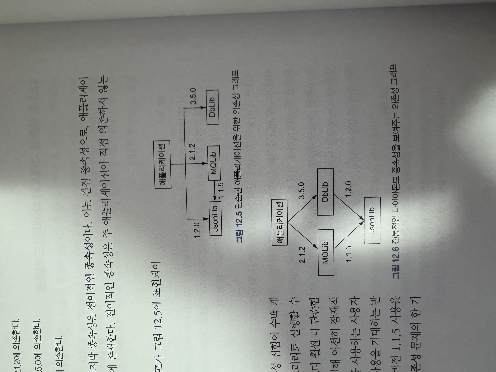
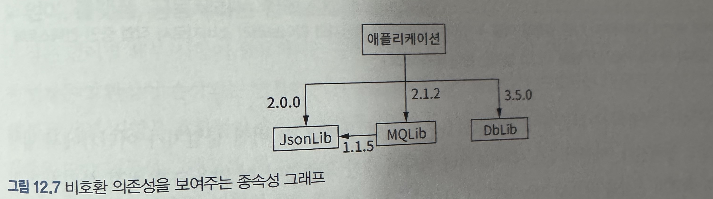

### 라이브러리를 위한 버전 관리

#### 소스 코드, 바이너리, 그리고 유의적 호환성

##### 소스 코드 호환성
* 특정 라이브러리가 이전 버전에도 대응하고, 이후버전에도 대응해 동작한다면 해당 라이브러리는 소스 코드 호환성을 갖는다고 함.
  * 자바에서는 해당 라이브러리를 사용하는 코드를 재컴파일 하는경우도 포함.
* 호환성이 손상되는 사례
  * 메서드 이름에서 특정 글자의 대소문자만 변경되는 경우
  * 매개변수 타입이 변경되는 경우

##### 바이너리 호환성
* 바이너리 호환성이 중요한 이유
  * 일반적으로 바이너리 호환성을 추론하기가 소스 코드 호환성을 추론하기보다 어렵다.
    * 보통 개발자들이 무시하는 추상화 계층을 수반하기 때문 ??
      * 대부분 바이트코드까지 알 필요는 없기 때문
    * 실행시간에만 문제를 목격할 수 있음.
      * 컴파일된 언어로 작업하는 개발자들은 컴파일 시간에 이런 유형의 문제를 컴파일러가 잡아주는것에 익숙하기 때문
    * Java의 경우 JVM이 누락된 메서드를 찾게 만드는 코드 경로로 실행되는 경우에만 문제를 목격하게 됨.
      * 철저한 테스트가 이뤄지지 않은 코드 경로는 일반적으로 오류 처리와 관련이 있으므로 오류와 관련해 이중고를 겪게 됨.

##### 의미론적인 호환성
* 동작방식과 관련된 부분.
* 대다수 구현 변경은 동작 방식을 많이 바꾸지는 않지만 아래 세가지 변경 유형은 주의 깊게 봐야함.
  * 매개변수 검증
    * AAA라는 메서드가 null을 허용하지 않았다가 업데이트 후 null을 허용하게 된다면 AAA라는 메서드를 사용하는 사용자쪽의 검증로직이 실패하는 경우 발생함.
  * 상속
    * 메서드의 재정의가 이루어질수 있기 때문
  * 성능 변경

#### 의존성 그래프와 다이아몬드 의존성
* 예시 : JSON 파일을 읽을 필요가 있고, 메시지 큐와 데이터베이스도 사용하는 애플리케이션의 의존성
  * 애플리케이션은 JsonLib 버전 1.2.0에 의존
  * 애플리케이션은 MQLib 버전 2.1.2에 의존
  * 애플리케이션은 DbLib 버전 3.5.0에 의존
  * MQLib JsonLib 버전 1.1.5 에 의존
  * 애플리케이션 관점에서 보면 마지막 종속성은 전이적인 종속성임.
* 단순한 애플리케이션을 위한 의존성 그래프와 다이아몬드 의존성 그래프
  

##### 공유된 의존성 대 격리된 의존성
* 종속성에 따른 초기 분류 
  * 공유되는지 또는 격리되는지
* 의존성이 공유되면 전체 애플리케이션은 단일 버전의 라이브러리를 사용한다.
* 공유된 의존성
  * 장점
    * 코드의 여러 사본은 더 많은 메모리를 차지하고 (또한 잠재적으로 배포를 위해 더 많은 디스크 공간을 차지한다), (개별적인 JIT 컴파일을 위한 바이트코드의 사본을 유지함에 따라) 더 많은 최적화 비용이 발생할 수 있다.
    * 초기화 비용이 많이 드는 자원 또는 캐시의 싱글턴은 전체 애플리케이션에 걸쳐 효율성 측면에서 이점을 제공한다.
    * 객체는 애플리케이션 내에서 여러 컴포넌트 사이에서 투명하게 전달될 수 있다.
  * 단점
    * 만일 공유 상태를 주의 깊게 설계하지 않으면 컴포넌트가 예상하지 못한 방식으로 서로를 간섭할 수 있다. (예를 들어, 두 컴포넌트가 각각 라이브러리 단위에서 캐시의 유일한 사용자라고 기대하면 서로의 가정을 위반할 수 있다.)
    * 만일 다른 컴포넌트들이 동일 라이브러리의 서로 다른 비호환 버전을 기대하면 어떤 단일 공유 버전도 양쪽을 모두 충족하지 못할 것이다.
* 격리된 의존성
  * 컴포넌트 하나의 의존성이 순전이 내부 구현 세부 사항으로 사용된다면 해당 종속성을 격리하는 방식이 잠재적인 비효율성을 제외하고는 매우 견고한 방법이 될 수 있음.

##### 주 버전의 고통
* 라이브러리의 비호환 버전 영향도
  
* 애플리케이션이 사용하는 의존성이 얽히고설킬수록 주버전 불일치가 어디선가 발생할 가능성이 높아진다.
* 라이브러리 버전을 올릴때 의존성이 걸려있는 다른 라이브러리도 충돌이 있는지 주의해야함.
  * 프레임워크 버전 업그레이드 시 의존성 제약때문에 시행착오가 많이 발생함.ㅠㅠ
  
#### 호환성에 손상을 가하는 변경을 처리하기 위한 기법

##### 언어, 플랫폼, 공동체라는 컨텍스트를 이해하라
* 언어별로 호환성이 손상되는 변경의 사례가 다르다
  * JAVA에서는 매개변수 이름변경이 문제가 없지만 C#에서는 문제가됨.

##### 공개 API 표면을 제한하라
* 공개 클래스를 선언하고 배포하면 오탈자를 수정하는것도 호환성에 손상이 가게된다.
  * 클래스를 라이브러리 내부에 보존하면 방지할 수 있음.
* 공개범위에 대한 고민이 많이 필요함 (트레이드오프 발생)
  * 모든 공개 클래스, 메서드, 속성, 인터페이스는 미래에 잠재적인 골칫거리임
  * 하지만 어떤것도 공개하지 않는다면 사용하기 어려워짐
* 적절한 상속 사용ㅉㅉ
  * 훌륭한 도구가 될수도 있지만, 파악하기 어려울 수도 있음.

##### 자신의 종속성에 주의하라
* 라이브러리에 공유된 의존성이 많을수록 더 많은 사용자가 이런 의존성에 대한 변경에 영향을 받게된다.

##### 호환성이 손상될 대상을 결정하라

##### 주 버전으로 올릴 때 배려하라
* 호환성이 손상되는 변경이 발생할 때 호환성이 손상되는 변경에 대한 문서를 체계적으로 유지하는 방식을 권장함.
  * 자세한 업그레이드 가이드 문서 등
* 주 버전을 자주 올릴수록 높은 비용이 발생함.

#### 내부 전용 라이브러리 관리하기
* PHP Composer의 경우 satis와 private packgist 구축을 통하여 사내 라이브러리의 버전 관리를 할수 있음.ㅉㅉ