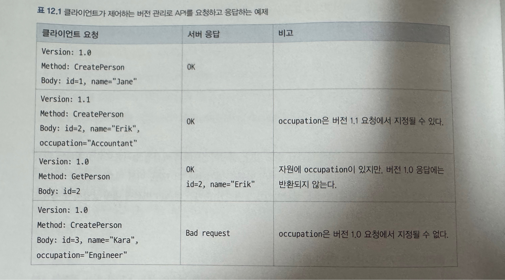

### 네트워크 API를 위한 버전 관리
* 책의 예시 네트워크를 통해 접근하는 요청-응답 서비스

#### 네트워크 API 호출이라는 컨텍스트
* 네트워크 API에서는 들어오는 요청을 확인할 수 있기에 API의 직접적인 사용 방식 관점에서 많은 정보가 존재함.
  * 하지만 일반적으로 API 호출이 생성되는 컨텍스트에 대한 정보는 부재하다.
    * 변경의 영향에 대해 추론이 어렵게 만들기도 함.
* 구 버전고 새 버전이 함께 동작하고 있는경우 고려사항
  * 서비스 전반에 걸쳐 배포하는 동안 예전 서버와 새 서버는 동시에 동작할 것이다. 현대적인 서비스는 서버를 새 버전으로 업데이트할 때 일반적으로 서비스 중단 시간을 요구하지 않게 설계돼야 한다.
  * 예전 버전만 인식하는 클라이언트와 새 버전을 인식하는 클라이언트가 동시에 동일 데이터에 접근할 수도 있다.

#### 고객 친화적인 명료함
* API 버전 관리에 앞서 요구사항에 대해 명확하게 정리가 필요하다.
* 고려할 사항
  * API가 특정 컨텍스트에서 전형적으로 사용되게 설계되었는가?
    * 이전에 설명된 트래픽 패턴과 파레토 법칙에 근거해서 고려
  * 주의를 요하는 향후 변경을 경고하기 위해 모든 사용자와 연결된 명확한 의사소통 채널이 존재하는가?
    * 대부분 오픈소스 라이브러리는 공식 사이트 또는 깃허브 리드미, 이슈를 통해 해당 부분 해결하는듯함.
  * 몇몇 API 버전에 대해 더 느슨한 안정성 요구사항이 받아들여지게 API 표면에서 고객과 협업하기를 기대하는가?
  * API가 얼마나 급격하게 진화하고, 고객이 얼마나 빨리 최신 버전으로 업데이트 하기를 기대하는가?
  * 예전 버전을 얼마나 오래 지원할 것인가? 그리고 그렇게 하면 고객 기대치를 충족할 수 있는가?
  * 버전, 클라이언트 라이브러리 RPC와 같은 개별 항목 관점에서 API의 사용 현황을 추척할 수 있는가?
* 일반적인 라이브러리의 경우 공급자가 지원을 중단한 이후에도 사용할 수 있지만, 네트워크 API의 경우 엔드포인트가 사라진다면 사용이 불가하다.

#### 일반적인 버전 관리 전략
* 가장 일반적인 버전 관리에 대한 접근방식
  * **실제로 문제가 아니기를 희망하며, 진행하면서 보완해가는 방식** (비 권장)
* 신중한 접근 방식
  * **클라이언트가 제어하는 버전 관리**
  * **서버가 제어하는 버전 관리**

##### 클라이언트가 제어하는 버전 관리
* 클라이언트가 정의한 버전이 코드가 알고 있는 정확한 API 표면을 결정
* 예시
  * 클라이언트는 심지어 다른 버전에 필드가 등장하는 경우에도 해당 버전에 없는 요청 필드를 지정해서는 안 된다.
  * 서버는 클라이언트가 요청한 버전에 없는 필드로 응답해서는 안 된다.
  * 서버는 클라이언트가 요청한 버전에 존재하지 않는 필드의 지식을 가정하는 방식으로 자원을 변경해서는 안 된다.
* 예제
 
* 구현에 비용이 많이 들어감
* 예전 버전 번호를 거부한다면 해당 버전의 모든 기존 클라이언트에 대한 호환성이 손상될 수 있다.
* 전혀 유효하지 않는 버전과 유효하지만 지원하지 않는 버전에대한 오류 내역에 대한 의사소통 중요.
* 단점
  * 요청을 어떻게 검증하고 응답에 어떤 필드가 포함될지를 알고 있어야 하기 때문에 새 버전의 구현이 모든 부 버전의 세부 사항을 챙겨야한다.

##### 서버가 제어하는 버전 관리
* 부 번호에 대한 개념이 없음.
* 동일한 주 번호 내에서 하위 호환성을 유지하는 방식으로만 진화할 수 있다.
* 클라이언트가 지정한 주 버전번호가 어딘가에는 명시되어 있어야만 함. 이런게 없다면 호환성에 손상을 입히지 않고는 변경이 불가.

#### 추가적인 버전 관리 고려 사항

##### 사전 릴리즈 버전 관리
* 사전 릴리즈 : 정식 릴리즈 이전에 초기 버전 또는 Beta등의 방식으로 개선사항 또는 신규 기능에 대한 내용을 먼저 릴리즈 하는것
* 사전 릴리즈시 고려사항
  * 고객이 실수로 안정적이지 않은 기능을 사용하지 않게 사전 릴리즈를 어떻게 통제하는가?
  * 각 요청이 사전 릴리즈 기능을 사용할 예정임을 어떻게 나타내야 하는가?
  * 안정된 API 버전과 완전히 독립적으로 사전 릴리즈 API 버전을 실행하는가? 아니면 두 종류의 트래픽을 API 서버 하나가 처리할 수 있는가?
  * API의 안정성과 가용성에 대해 고객에게 어떤 보장을 제공하는가? 예를들어, 각 요청이 사용되고 있는 사전 릴리스 API 버전을 필요로 한다면, 얼마나 오랫동안 개별 버전을 동작시켜야만 하는가? 호환성이 손상되는 변경을 급작스럽게 만들 수 있는가? 아니면 짧은 지원 중단 기간을 가져가는가?
  * 고객에게 사전 릴리즈를 사용 가능하게 만드는 방법은 무엇이며, 고객을 위한 클라이언트 라이브러리가 존재하는가?
  * 사전 릴리즈를 어떻게 문서화하는가?
  * 모든 사전 릴리즈를 외부에 공개하는가? 아니면 모두 비공개하는가? 아니면 일부는 공개하고 일부는 비공개 하는가?
  * 고객별 사전 릴리즈가 필요한가?
  * 위 고려사항들을 위한 내부 도구와 프로세스가 존재하는가

##### 서버 배포
* API를 위해 사용하는 서버의 배포 공개 단계
  * 카나리 서버 집합에 배포
  * 카나리 서버 오류 모니터링
  * 카나리 서버에 대해 새로운 API 기능 테스트
  * 서버의 나머지에 배포
  * 임의로 선택한 특정 서버에 새로운 API 기능 테스트
  * 새로운 API 세부 사항을 공개

##### 교차 버전 지원 처리
* v1의 사용자가 v2의 내용도 사용할 수 있도록 처리하는 경우도 종종 있음.