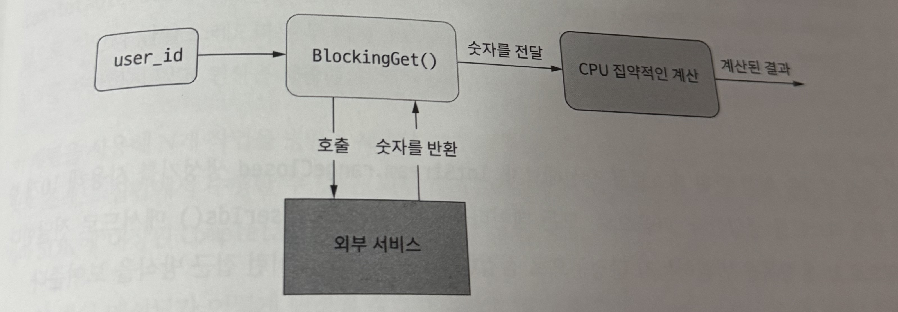

### 리액티브 프로그래밍을 사용할 때
* 리액티브 프로그래밍 : 비차단 방식으로 동작하는 함수형의 데이터 주도 처리 방식
  * 핵심 특징
    * 배압 (back-pressure)
      * 생산자(Publisher)가 데이터를 너무 빠르게 밀어낼 때, 소비자(Subscriber)가 그 속도를 감당하지 못하면 생기는 문제를 제어하는 메커니즘

#### 단일 스레드, 차단 처리 생성하기
* I/O와 CPU 집약적인 작업
  

#### 리액티브 해법을 구현하기
* Flux 추상화
  * Reactor 라이브러리에서 제공하는 Publisher 구현체
  * 0 ~ N개의 비동기 데이터 시퀀스를 나타내는 리액티브 스트림
  * 시간이 지남에 따라 여러 개의 이벤트(데이터)를 발행할 수 있음

#### 리액트 프로그래밍의 장 단점
* 장점
  * 고성능 비동기 처리 가능 (특히 I/O 많은 시스템)
  * 이벤트 기반 UI, 실시간 데이터 처리에 강함
  * 선언적이라 코드 가독성↑
* 단점
  * 학습곡선이 있음 (스트림, 옵저버 패턴 이해 필요)
  * 디버깅이 어려움
  * 작은 규모에서는 오히려 과한 설계

