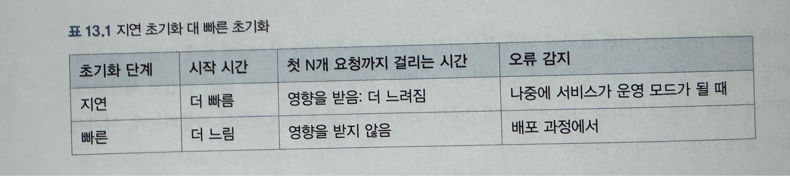

### 지연(lazy) 평가 대 빠른(eager) 평가
* 지연 초기화
  * 객체가 생성될 때 바로 초기화하는 방식
  * 애플리케이션 시작 시점에 필요한 리소스를 미리 준비해둠
* 빠른 초기화
  * 실제로 필요할 때까지 초기화를 미루는 방식
  * 안 쓸 수도 있는데 굳이 미리 만들 필요 없다
* 지연 초기화 나 빠른 초기화 선택 시, 시작 시간을 늘이는지 요청 처리 시간을 늘이는지에 대한 선택 시 주의가 필요함.

