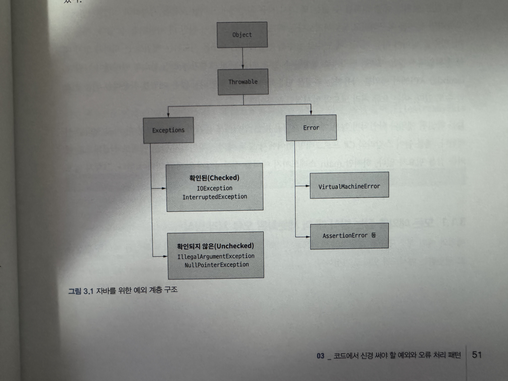

# 3장
### 코드에서 신경 써야 할 예외와 오류 처리 패턴
* 오류와 예외는 코드에서 불가피 하게 발생
  *  코드는 `내결함성`이 있어야함.
     *  프로그램이 예기치 못한 오류나 실패 상황에서도 전체 시스템을 중단시키지 않고 계속 동작하거나 안전하게 회복하는 능력
  * 모든 오류를 코드에서 복구하려고 애쓸 필요는 X
    *  `Let it crash (충돌이 일어나게 내버려두는)` 철학
  
---

### 3.1 예외의 계층구조
* Java의 대표적인 예외 클래스 계층 구조


* 예외를 사용하여 코드 내에 문제가 일어났다는 사실을 알리고, 복구하는 방법이 있다면 예외를 처리해야 함.
* 확인되지 않은 예외라면 종종 문제를 처리하려 노력하기 보다는 빠르게 실패하는 편이 더 바람직 할 수 있음.

---

#### 3.1.1 모든 예외를 잡는 방식 대 더 세분화된 오류 처리 방식
* `코드3.1`
```java
public void methodThatThrowsCheckedException()
    throws FileAlreadyExistsException, InterruptedException
```

* **FileAlreadyExistsException**과 **InterruptedException**은 확인된 예외.
* `코드3.2`
  ```java
  public void shouldCatchAtNormalGranularity() {
    try {
        methodThatThrowsCheckedException();
    } catch (FileAlreadyExistsException e) { // <- FileAlreadyExistsException을 잡는다.
        logger.error("File already exists: ", e);
    } catch (InterruptedException e) { // <- 직전 예외와 무관한 다른 예외를 잡는다.
        logger.error("Interrupted", e);
    }
  }
  ```

  * 두 **catch** 블럭을 통해 타입에 따라 다른 예외처리 동작 방식을 제공.


##### 예외 계층을 사용하는 경우
  * `코드3.3`
```java
public void shouldCatchAtHigherGranularity() {
    try {
        methodThatThrowsCheckedException();
    } catch (IOException e) { // <- FileAlreadyExistsExceptiondms IOException을 상속받으므로 여기서 IOException이 해당 예외를 대신 처리한다.
        logger.error("Some IO problem: ", e);
    } catch (InterruptedException e) { 예외를 잡는다.
        logger.error("Interrupted", e);
    }
}
```
* 해당 코드로 알 수 있는 결과
  * 실행 시점에는 **FileAlreadyExistsExceptiondms** 예외 정보가 존재하지만 컴파일 시점에는 **IOException** 예외를 던졌다는 정보만 얻을수 있음.


##### 모든 예외 잡기
  * `코드3.4`
```java
public void shouldCatchAtCatchAll() {
    try {
        methodThatThrowsCheckedException();
    } catch (Exception e) { // 확인된 / 확인되지 않은 경우와 무관
        logger.error("Problem ", e);
    }
}
```
  * 코드결과
    * 코드를 적게 요구하여 편리하나 필요할 수 있는 많은 정보를 잃어버림.

##### 다중 chatch블록 사용
- `코드3.5`
```java
public void shouldCatchUsingMultiCatch() {
  try {
    methodThatThrowsCheckedException();
  } catch (IOException | InterruptedException e) {
    logger.error("Problem ", e);
  }
}
```

##### 확인되지 않은 예외 던지기
- `코드3.6`
```java
public void shouldThatThrowsUncheckedException()
  throws FileAlreadyExistsException, InterruptedException {
    throw new RuntimeException("Unchecked exception!");
  }
```
- `코드3.4`는 예외가 일어나기를 기대하지 않음에도 이 문제를 잡을것.

##### 확인되지 않은 예외를 던지는 메서드 호출
- `코드3.7`
```java
public void shouldCatchAtNormalGranularityRuntimeWillBeNotCatch() {
  assertThatThrownBy(
    () -> {
      try {
        methodThatThrowsUncheckedException(); // 확인되지 않은 예외
      } catch (FileAlreadyExistsException e) {
        logger.error("File already exists: ", e);
      } catch (InterruptedException e) {
        logger.error("Interrupted", e);
      }
    })
    .isInstanceOf(RuntimeException.class); // 잡히지 않는 전파된 예외는 RuntimeException이다.
}
```
* **catch**블럭이 **methodThatThrowsUncheckedException()** 시그니처에 선언된 예외만 잡는다는 사실 주목 
  * **Exception**을 위한 **catch**를 선언하지 않으므로 확인되지 않은 예외는 처리되지 않음. 


### 결론

**특정 상황에 맞는 예외처리 방식을 사용하기위해 예외 계층을 이해해야함**
