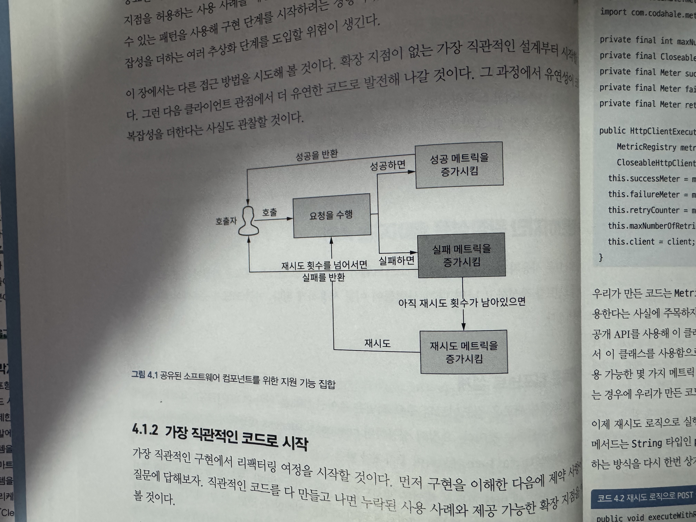

## 유연성과 복잡성 사이의 균형
### 4-1 탄탄하지만 확장성은 떨어지는 API
#### 4.1.1 새로운 컴포넌트 설계
* **행위를 재시도할 수 있는 가능성**
* **컴포넌트 지원기능 집합**


#### 4.1.2 가장 직관적인 코드로 시작

##### HttpClientExecution 매개변수
* `코드4.1` ***생략***
* **MetricRegistry** Class를 제공하는 타사 라이브러리를 사용.
* HttpClientExecution을 특정 메트릭 라이브러리(MetricRegistry)와 결합하여 사용.

##### 재시도 로직으로 POST실행
* `코드4.2`
```java
public void executeWithRetry(String path) {
    for (int i = 0; i <= maxNumberOfRetires; i++) {
        try {
            execute(path);
            return;
        } catch (IOException e) {
            logger.error("Problem when sending request for retry number:" + i, e);
            failureMeter.mark();
            
            if (maxNumerOfRetries == i) {
                logger.error("This is the last retry, failing.");
                throw new RuntimeException(e);
            } else {
                logger.info("Retry once again");
                retryCounter.mark();
            }
        }
    }
}

private void execute(String path) throws IOException {
    CloseableHttpResponse execute = client.execute(new HttpPost(path));
    if (execute.getStatusLine().getStatusCode() == HttpStatus.SC_OK) { // 200
        successMeter.mark();
    } else { // 200 외의 코드
        failureMeter.mark();
    }
}
```
* 위의 사진에 있는 그림 로직과 동일한 코드임.

##### 재시도 없이 성공 검증
* `코드4.3` ***생략***
##### 재시도 과정에서 실패 검증
* `코드4.4` ***생략***

#### 정리
* 확장 지점이 부족하여, 클라이언트에게 특정 메트릭 라이브러리 구현을 사용하도록 강제함 -> 강한결합도.
  * 최종 사용자는 라이브러리를 원하는대로 골라서 사용할 수 있어야함.