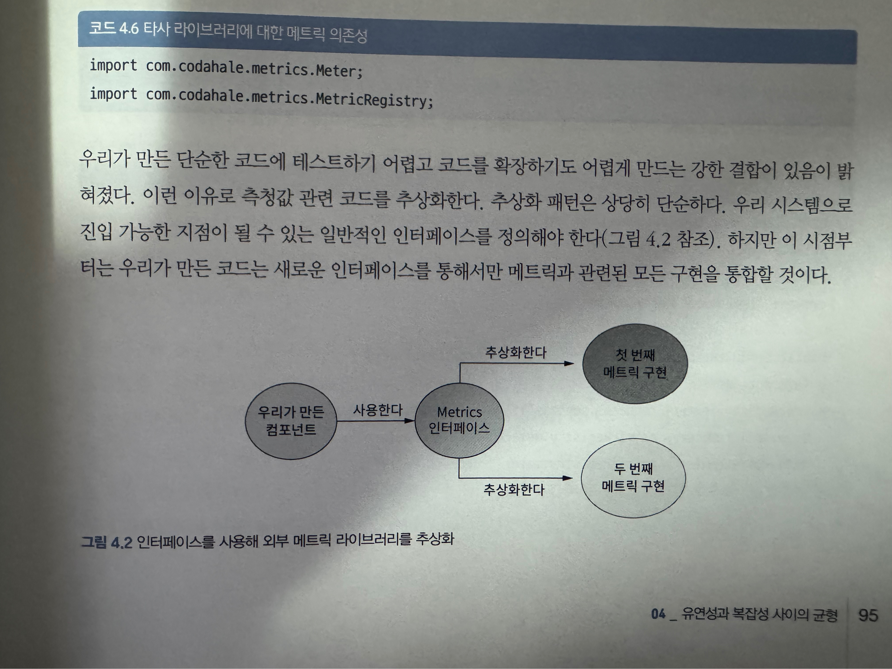

### 4-2 클라이언트에게 자신만의 메트릭 프레임워크를 제공하게 허용하기

  
  ##### 새로운 메트릭 인터페이스 정의
  * `코드4.7`
```java
public interface MetricsProvider {
    void incrementSuccess();
    void incrementFailure();
    void incrementRetry();
}
```
  * 인터페이스를 통하여 컴포넌트 밖으로 데이터를 가져오는 행위를 제한.
    * 사용자가 메트릭을 추적하기 위한 메트릭 레지스트리를 삽입 할 수 있어 타당한 제약.
    * 강한 결합 제거
##### 메트릭 제공자 구현
* `코드4.8`
```java
public class DefaultMetricsProvider implements MetricsProvider {
    private final Meter successMeter;
    private final Meter failureMeter;
    private final Meter retryMeter;

    public DefaultMetricsProvider(MetricRegistry metricRegistry) {
        this.successMeter = metricRegistry.meter("requests.success");
        this.failureMeter = metricRegistry.meter("requests.failure");
        this.retryMeter = metricRegistry.meter("requests.retry");
    }

    @Overide
    public void incrementSuccess() {
        successMeter.mark();
    }

    @Overide
    public void incrementFailure() {
        failureMeter.mark();
    }

    @Overide
    public void incrementRetry() {
        retryMeter.mark();
    }
}
```

* 구현 세부사항 추상화 및 HttpClientExecution 로직 단순화.
* 컴포넌트 복잡성 감소 (내부적으로만 -> 외부 클라이언트에게 복잡성 전가)
* 유연성 증가
* 기본 구현을 제공하면 양쪽(내부, 사용자)에 이로운 코드가 될 가능성 존재.