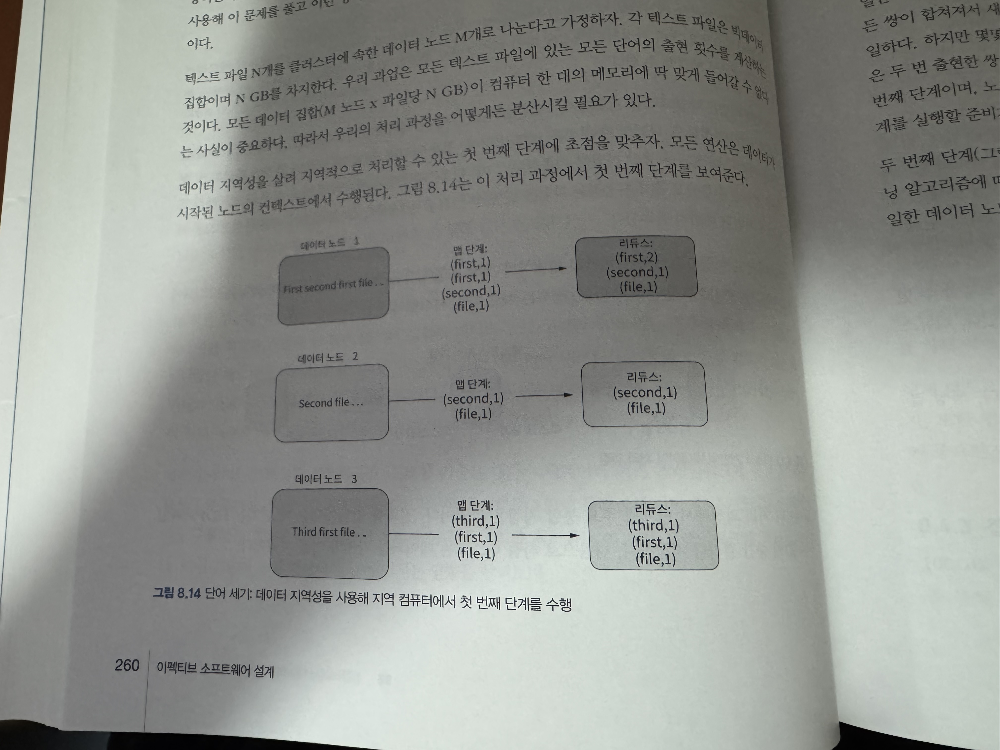

### 데이터 처리 과정 : 메모리 대 디스크
#### 디스크 기반의 처리과정
* 사용자 데이터가 메모리에 맞지 않으므로 처리 과정에서 디스크에 접근할 필요가 있다고 가정할때 해법
  * 파일 조각을 지연시켜서 읽는 방법
    * 표준 맵리듀스 하둡 기반의 빅데이터 처리 과정의 작동방식임.

#### 맵리듀스가 필요한 이유
* 맵리듀스 이면의 핵심 아이디어는 데이터 지역성.

* 첫번째 단계
  * 데이터 파티셔닝
* 두번째 단계
  * 네트워크를 활용한 데이터 섞기

#### 램 기반의 처리 과정
* 빅데이터 처리를 위한 진입점은 몇 파일 시스템에서 데이터를 가져오게끔 요구함.
  * 데이터 지역성 관점에서 보면 지역 디스크에서 메모리로 가져오게 하는것.
